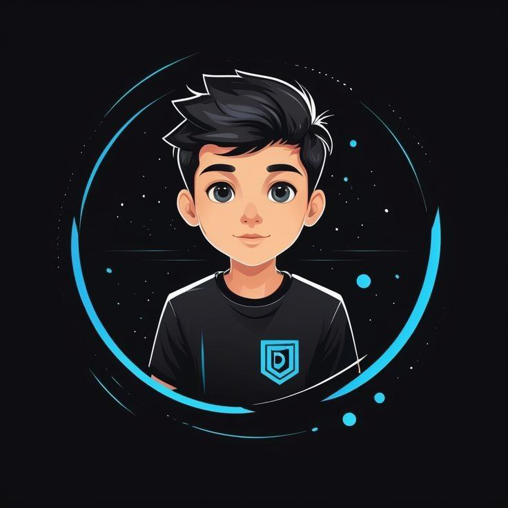

  

<em>The Future of Color Trading</em>

---

## 🚀 Welcome to S3 Alpha

> **S3 Alpha** is a powerful and uncrackable color trading prediction tool designed for real-time accuracy and profitability. Built with **advanced APIs**, **server-side calculations**, **AI-driven analytics**, and a **robust refund system**, S3 Alpha stands out as the ultimate predictor in the market.

## About S3 Alpha

  <h3 style="color: #ff6b6b;">What Makes S3 Alpha Special?</h3>
  <ul style="list-style: none; padding: 0;">
    <li style="margin: 10px 0;"> <strong style="color: #333;">Powerful Predictions</strong>: Achieve under 2-3 level wins with top accuracy, enhanced by AI pattern recognition.</li>
    <li style="margin: 10px 0;"> <strong style="color: #333;">Real-Time Predictions</strong>: Powered by advanced APIs, server calculations, and live market data.</li>
    <li style="margin: 10px 0;"> <strong style="color: #333;">Uncrackable Security</strong>: Multi-layer encryption and blockchain-based protection—unbreakable!</li>
    <li style="margin: 10px 0;"> <strong style="color: #333;">Loss Refund Policy</strong>: Industry-first refund system with instant processing for peace of mind.</li>
  </ul>

## Loss Refund Policy

  <h3 style="color: #856404;">How Our Refund System Works</h3>
  
<strong>Updated Refund Rules:</strong>

  <ul style="padding-left: 20px;">
    <li> 3-Day Key: <strong>No Refund</strong>.</li>
    <li> 7-Day, 15-Day, and 1-Month Keys: <strong>Single-Time Refund</strong> (40-60% of key price based on admin approval).</li>
  </ul>
  <ol style="padding-left: 20px;">
    <li> <strong>Check Your Info</strong>: Verify your refund eligibility status via the in-app dashboard.</li>
    <li> <strong>Eligibility Criteria</strong>: After 2 times of 5 back-to-back losses, you're eligible.</li>
    <li> <strong>Submit Proof</strong>: Use the button below to upload proof.</li>
    <li> <strong>Get Refund</strong>: Receive 40-60% of your key price instantly after verification.</li>
  </ol>
  

    
 Tap to Submit Proof

    

      Upload your loss screenshots and game screenshots via the Sliza Assist Bot. Wait for admin approval (processed within 24 hours). Once approved, your refund (40-60% of key price) will be credited instantly.
    

  

  
<em> Note: Always check your refund status before proceeding!</em>

## How to Use S3 Alpha

  <h3 style="text-align: center; font-size: 24px; text-shadow: 1px 1px 2px rgba(0,0,0,0.3);">Simple Steps to Master S3 Alpha</h3>
  <ol style="padding-left: 20px; font-size: 16px;">
    <li style="margin: 10px 0;"> <strong>Download the APK</strong>: Get the S3 Alpha app from the official source—fast and secure.</li>
    <li style="margin: 10px 0;"> <strong>Buy a Key</strong>: Purchase your activation key from <code>@enzosrs</code> on Telegram to unlock premium features.</li>
    <li style="margin: 10px 0;"> <strong>Open & Play</strong>: Launch the app, enter your key, and trade with AI-guided precision.</li>
  </ol>
  <h4 style="color: #fff; text-align: center; font-size: 20px; margin-top: 20px; text-shadow: 1px 1px 2px rgba(0,0,0,0.3);">Pro Tip for Permanent Profit</h4>
  

     <strong style="color: #ffd700;">Wait for the Perfect Moment</strong>: Use the in-app trend analyzer to spot 5 back-to-back losses at any level. Play the next trade—losses are minimized, and wins are almost guaranteed! Trade smart, win big!
  

## Key Pricing

  <h3 style="color: #343a40;">Choose Your Plan</h3>
  <ul style="list-style: none; padding: 0;">
    <li style="margin: 10px 0;"> <strong>3 Days</strong>: ₹399 (No Refund)</li>
    <li style="margin: 10px 0;"> <strong>7 Days</strong>: ₹699 (Single-Time Refund: 40-60%)</li>
    <li style="margin: 10px 0;"> <strong>15 Days</strong>: ₹999 (Single-Time Refund: 40-60%)</li>
    <li style="margin: 10px 0;"> <strong>1 Month</strong>: ₹1499 (Single-Time Refund: 40-60%)</li>
  </ul>

## Advanced Features

  <h3 style="color: #fff;">Next-Level Trading Tools</h3>
  <ul style="list-style: none; padding: 0;">
    <li style="margin: 10px 0;"> <strong>AI Trend Analyzer</strong>: Predicts patterns with 90%+ accuracy using machine learning.</li>
    <li style="margin: 10px 0;"> <strong>Live Analytics Dashboard</strong>: Real-time stats, win/loss tracking, and profit forecasts.</li>
    <li style="margin: 10px 0;"> <strong>Quantum Encryption</strong>: Military-grade security for your data and transactions.</li>
    <li style="margin: 10px 0;"> <strong>Auto-Trade Bot</strong>: Automate trades based on pre-set strategies for hands-free profits.</li>
    <li style="margin: 10px 0;"> <strong>Voice Commands</strong>: Control the app with simple voice instructions.</li>
  </ul>

## Future Updates

  <h3 style="color: #f3f4f6;">What’s Coming Next?</h3>
  <ul style="list-style: none; padding: 0;">
    <li style="margin: 10px 0;"> <strong>AI-Powered Prediction 2.0</strong>: Smarter algorithms for near-perfect trading insights.</li>
    <li style="margin: 10px 0;"> <strong>Mobile App Overhaul</strong>: Smoother UI, faster performance, and AR trading visuals.</li>
    <li style="margin: 10px 0;"> <strong>Community Trading</strong>: Collaborate with other traders for shared strategies and profits.</li>
  </ul>

## Testimonials

  <h3 style="color: #1e40af;">What Users Say</h3>
  <blockquote style="margin: 10px 0; padding: 10px; background: #dbeafe; border-radius: 5px; border-left: 4px solid #1e40af;">
    
 "S3 Alpha’s AI predictions turned my losses into profits in just a week!" - <em>Rahul K.</em>

  </blockquote>
  <blockquote style="margin: 10px 0; padding: 10px; background: #dbeafe; border-radius: 5px; border-left: 4px solid #1e40af;">
    
 "The refund policy and auto-trade bot gave me confidence to win big!" - <em>Priya S.</em>

  </blockquote>
  <blockquote style="margin: 10px 0; padding: 10px; background: #dbeafe; border-radius: 5px; border-left: 4px solid #1e40af;">
    
 "Uncrackable security and unbeatable accuracy—best predictor ever!" - <em>Ajay M.</em>

  </blockquote>
  <blockquote style="margin: 10px 0; padding: 10px; background: #dbeafe; border-radius: 5px; border-left: 4px solid #1e40af;">
    
 "Real-time analytics changed my trading game completely!" - <em>Neha R.</em>

  </blockquote>
  <blockquote style="margin: 10px 0; padding: 10px; background: #dbeafe; border-radius: 5px; border-left: 4px solid #1e40af;">
    
 "Voice commands and the dashboard are worth every penny!" - <em>Vikram T.</em>

  </blockquote>

## Contact Us

  <h3 style="color: #fff;">Get in Touch</h3>
  
 Reach out on Telegram: <code>@enzosrs</code>

  

    <h2>Developer Info</h2>
    
Hello! I'm Enzo, an experienced Web Developer, Android App Developer, and Advanced Telegram Bot Creator. I specialize in crafting intuitive applications, robust web platforms, and innovative automation solutions. My work is focused on delivering high-quality, user-friendly experiences that blend functionality with cutting-edge technology.

    <h3>🛠️ Programming Languages</h3>
    <ul>
      <li> HTML</li>
      <li> CSS</li>
      <li> JavaScript</li>
      <li> Python</li>
      <li> React JS</li>
      <li> PHP</li>
      <li> Bash</li>
    </ul>
  

  

    
  

